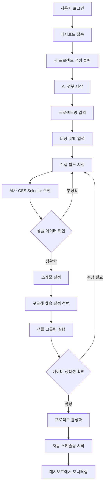

# DCS (Dynamic Crawling Service) - 제품 요구 사양서 (PRD)

**버전**: 2.0  
**최종 수정일**: 2025-01-21  
**작성자**: Product Team  
**상태**: Draft

---

## 📋 목차

1. [개요](#개요)
2. [사용자 페르소나](#사용자-페르소나)
3. [문제 정의](#문제-정의)
4. [솔루션](#솔루션)
5. [핵심 기능](#핵심-기능)
6. [기술적 제약사항](#기술적-제약사항)
7. [성공 지표](#성공-지표)
8. [구현 로드맵](#구현-로드맵)
9. [리스크 평가](#리스크-평가)
10. [비기능적 요구사항](#비기능적-요구사항)
11. [부록](#부록)

---

## 개요

### 제품 비전

**DCS (Dynamic Crawling Service)**는 비개발자도 쉽게 사용할 수 있는 AI 기반 웹 크롤링 플랫폼입니다. 사용자는 자연어 대화를 통해 복잡한 데이터 수집 프로젝트를 생성하고, 자동화된 스케줄링으로 주기적인 데이터 수집을 실현할 수 있습니다.

### 핵심 가치 제안

- **단순함**: 코딩 지식 없이 챗봇과의 대화만으로 크롤러 생성
- **지능화**: AI가 HTML을 분석하여 CSS Selector 자동 추천
- **자동화**: 스케줄링을 통한 완전 자동 백그라운드 실행
- **유연성**: 프로젝트별 커스텀 데이터 스키마 완벽 지원
- **확장성**: 대규모 데이터 수집 작업의 분산 처리

### 대상 시장

- **1차 타겟**: 데이터 분석가, 마케터, 연구원 (비개발자)
- **2차 타겟**: 개발팀 (반복적인 크롤링 요청 자동화)
- **시장 규모**: 국내 데이터 수집 니즈를 가진 기업/개인 (추정 10만+ 잠재 사용자)

### 차별화 요소

| 기존 솔루션                          | DCS                     |
| ------------------------------------ | ----------------------- |
| 코딩 필수 (Python, BeautifulSoup 등) | 자연어 대화로 설정      |
| 수동으로 CSS Selector 찾기           | AI 자동 추천            |
| Cron 설정 직접 작성                  | 자연어로 스케줄 설정    |
| 단일 스키마                          | 프로젝트별 동적 스키마  |
| 로컬 실행                            | 클라우드 기반 분산 실행 |

---

## 사용자 페르소나

### 페르소나 1: 데이터 분석가 (김민지, 32세)

**배경**

- 마케팅 회사 데이터 분석팀 소속
- Excel, SQL은 능숙하지만 Python 코딩은 어려움
- 경쟁사 가격 정보를 주 1회 수집하여 보고서 작성

**목표**

- 수동 복사-붙여넣기 작업 자동화
- 데이터 수집 시간 단축 (주 4시간 → 30분)
- 실시간 가격 변동 모니터링

**Pain Points**

- 매주 256개 웹페이지를 일일이 방문하여 데이터 복사
- 웹사이트 구조 변경 시 수집 방법을 다시 배워야 함
- 주말에도 데이터 수집 작업 필요

**DCS 사용 시나리오**

1. 챗봇에게 "경쟁사 가격 모니터링" 프로젝트 생성 요청
2. 대표 URL 1개 제공하고 "상품명", "가격", "재고" 필드 지정
3. AI가 자동으로 CSS Selector 추천 → 샘플 데이터 확인
4. "매주 월요일 오전 9시" 스케줄 설정
5. 이후 자동으로 데이터 수집 → API로 BI 도구에 연동

---

### 페르소나 2: 연구원 (박준호, 28세)

**배경**

- 대학원 석사과정 (사회학)
- 논문을 위해 전국 지자체 복지기관 정보 수집 필요
- 프로그래밍 경험 전무

**목표**

- 256개 지자체 웹사이트에서 복지기관 정보 수집
- 월 1회 업데이트된 데이터 확보
- 수집 데이터를 CSV로 내보내 분석

**Pain Points**

- 각 지자체마다 웹사이트 구조가 달라 일관된 수집 방법 없음
- 수동 수집 시 8시간 이상 소요
- 데이터 누락 및 오타 발생 위험

**DCS 사용 시나리오**

1. "전국 지자체 복지기관" 프로젝트 생성
2. 대표 지자체 URL 제공 후 "기관명", "주소", "전화번호" 필드 설정
3. 256개 지자체 URL 목록 업로드
4. "매월 1일 새벽 3시" 자동 수집 설정
5. 대시보드에서 수집 현황 확인 → API로 데이터 추출

---

### 페르소나 3: IT 관리자 (이수진, 35세)

**배경**

- 중소기업 IT팀 리더
- 현업 부서에서 반복적인 데이터 수집 요청 받음
- 개발 리소스 부족으로 모든 요청 처리 불가

**목표**

- 현업이 직접 크롤링 프로젝트 생성하도록 셀프서비스 제공
- IT팀 개입 없이 데이터 수집 자동화
- 수집된 데이터를 안전하게 API로 제공

**Pain Points**

- 단순 반복 작업에 개발 리소스 소모
- 크롤러 유지보수 부담 (웹사이트 변경 시)
- 부서별 요청 우선순위 조율 어려움

**DCS 사용 시나리오**

1. 현업 사용자에게 DCS 계정 발급
2. 각 부서가 챗봇으로 자체 프로젝트 생성
3. IT팀은 대시보드에서 전체 프로젝트 모니터링만 수행
4. API 키 관리 및 데이터 접근 권한 통제

---

## 문제 정의

### 현재 상황

웹 데이터 수집(크롤링)은 다음과 같은 이유로 비개발자에게 큰 진입 장벽이 있습니다:

1. **기술적 복잡성**
   - CSS Selector, XPath 등 기술 용어 이해 필요
   - Python, JavaScript 등 프로그래밍 언어 학습 필수
   - 헤드리스 브라우저 설정 및 운영 어려움

2. **동적 스키마 문제**
   - 수집 대상마다 데이터 구조가 달라 범용 도구 사용 불가
   - 프로젝트별 커스텀 개발 필요

3. **유지보수 부담**
   - 대상 웹사이트 구조 변경 시 크롤러 수정 필요
   - 변경 감지 및 대응에 많은 시간 소요

4. **자동화 설정 어려움**
   - Cron 표현식 작성 및 스케줄러 설정 복잡
   - 실패 시 재시도 로직 구현 필요

### 정량적 문제 지표

- **시간 소모**: 256개 웹페이지 수동 수집 시 평균 8시간 소요
- **오류율**: 수동 복사-붙여넣기 시 데이터 오류율 15%
- **유지보수 비용**: 웹사이트 구조 변경 시 크롤러 수정에 평균 4시간 소요
- **기회 비용**: 개발팀의 30% 리소스가 단순 크롤링 요청 처리에 사용

### 기존 해결 방법의 한계

| 해결 방법            | 한계점                            |
| -------------------- | --------------------------------- |
| **수동 수집**        | 시간 소모, 오류 발생, 확장 불가   |
| **외주 개발**        | 비용 높음, 유지보수 어려움        |
| **기존 크롤링 도구** | 기술 지식 필요, 설정 복잡         |
| **RPA 도구**         | 라이선스 비용, 동적 스키마 미지원 |

---

## 솔루션

### 솔루션 개요

**"AI 챗봇 기반의 프로젝트형 동적 크롤링 서비스 (DCS)"**

사용자가 자연어 대화를 통해 수집 주제, 대상, 조건, 주기를 설정하면, AI 챗봇이 이를 기술적인 크롤링 설정(JSON)으로 자동 변환합니다. 사용자는 코딩이나 CSS Selector에 대한 지식 없이도 복잡한 데이터 수집 프로젝트를 생성, 예약, 실행 및 모니터링할 수 있습니다.

### 아키텍처 개요

```
┌─────────────────────────────────────────────────────────┐
│                    사용자 (웹 브라우저)                    │
└────────────────────┬────────────────────────────────────┘
                     │
                     ▼
┌─────────────────────────────────────────────────────────┐
│              Next.js Application (Frontend)              │
│  - 대시보드 UI (React + shadcn/ui + Tailwind)            │
│  - AI 챗봇 인터페이스                                     │
└────────────────────┬────────────────────────────────────┘
                     │
                     ▼
┌─────────────────────────────────────────────────────────┐
│           Next.js API Routes (Backend API)               │
│  - 프로젝트 관리 API                                      │
│  - 챗봇 API (AI Selector 추천)                           │
│  - 데이터 접근 API                                        │
└────────┬───────────────────────────┬────────────────────┘
         │                           │
         ▼                           ▼
┌──────────────────┐        ┌──────────────────┐
│   PostgreSQL     │        │  Gemini AI API   │
│  (프로젝트 설정,  │        │  (Selector 추천)  │
│   수집 데이터)    │        └──────────────────┘
└──────────────────┘
         │
         ▼
┌─────────────────────────────────────────────────────────┐
│                    GCP Services                          │
│  ┌──────────────┐  ┌──────────────┐  ┌──────────────┐  │
│  │Cloud Scheduler│→│Cloud Pub/Sub │→│  Cloud Run   │  │
│  │(스케줄 트리거) │  │ (작업 큐)     │  │(크롤링 엔진)│  │
│  └──────────────┘  └──────────────┘  └──────────────┘  │
└─────────────────────────────────────────────────────────┘
```

### 핵심 기술 스택

- **프론트엔드**: Next.js 16+, React 19, TypeScript, Tailwind CSS, shadcn/ui
- **백엔드**: Next.js API Routes, Prisma ORM
- **데이터베이스**: SQLite (로컬), PostgreSQL (프로덕션)
- **AI**: Google Gemini API (CSS Selector 추천)
- **크롤링**: Playwright (헤드리스 브라우저)
- **인증**: Clerk
- **클라우드**: Google Cloud Platform (Cloud Run, Pub/Sub, Cloud Scheduler)

### 사용자 플로우



---

## 핵심 기능

### 우선순위 정의 (MoSCoW)

- **Must Have (P0)**: MVP 출시에 필수
- **Should Have (P1)**: 출시 직후 추가
- **Could Have (P2)**: 향후 개선 사항
- **Won't Have**: 현재 범위 외

---

### F-01: AI 기반 챗봇 설정 마법사 (P0 - Must Have)

**설명**  
프로젝트 생성을 안내하는 핵심 인터페이스. 사용자는 자연어 대화를 통해 크롤링 프로젝트를 설정합니다.

**기능 요구사항**

1. **대화형 프로젝트 생성**
   - 챗봇이 순차적으로 질문 (프로젝트명, 대상 URL, 수집 필드 등)
   - 사용자 입력 검증 (URL 형식, 필드명 유효성)
   - 이전 단계로 돌아가기 기능

2. **AI CSS Selector 추천**
   - 사용자가 필드명만 입력 (예: "기관명", "가격")
   - 백엔드에서 대상 URL의 HTML 분석
   - Gemini AI가 가장 적합한 CSS Selector 추천
   - 추천 Selector로 추출한 샘플 데이터 제시
   - 사용자 승인/거부 옵션

3. **자연어 스케줄 설정**
   - 자연어 입력 지원 (예: "매일 아침 9시", "매월 1일")
   - Cron 표현식 자동 변환
   - 변환된 Cron 표현식 사용자에게 확인
   - 일반적인 스케줄 템플릿 제공

4. **구글챗 웹훅 설정 (선택사항)**
   - 웹훅 URL 입력 옵션
   - 건너뛰기 가능
   - 웹훅 URL 형식 검증

5. **샘플 크롤링 및 확정**
   - 설정 완료 후 샘플 크롤링 실행
   - 수집된 데이터 1~5건 표시
   - 사용자가 "확정"해야만 프로젝트 활성화

**수용 기준 (Acceptance Criteria)**

- [ ] 비개발자가 5분 이내에 프로젝트 생성 완료
- [ ] AI Selector 추천 정확도 85% 이상
- [ ] 자연어 스케줄 변환 성공률 95% 이상
- [ ] 챗봇 응답 시간 3초 이내
- [ ] 샘플 크롤링 실행 시간 10초 이내

**엣지 케이스**

- 잘못된 URL 입력 시 → 형식 검증 및 재입력 요청
- AI가 Selector를 찾지 못한 경우 → 안내 메시지 및 고객지원 안내
- 샘플 크롤링 실패 시 → 에러 메시지 표시 및 재시도 옵션

**관련 문서**  
→ [상세 명세](file:///Users/gangseungsig/Documents/02_GitHub/09_Dynamic%20Crawling%20Service/specs/001-ai-chatbot-crawling-system/spec.md#user-story-1)

---

### F-02: 프로젝트 관리 대시보드 (P0 - Must Have)

**설명**  
모든 크롤링 프로젝트의 현황을 한눈에 파악하는 웹 기반 모니터링 대시보드.

**기능 요구사항**

1. **프로젝트 목록 뷰**
   - 프로젝트명, 상태, 마지막 실행일, 다음 실행일 표시
   - 상태별 필터링 (Active, Paused, Error)
   - 검색 기능 (프로젝트명)
   - 정렬 기능 (생성일, 실행일)

2. **프로젝트 상세 현황**
   - 개별 작업의 성공/실패/대기 상태 시각화
   - 256개 지자체 등 대규모 작업의 진행률 표시
   - 테이블 또는 지도 뷰 제공
   - 실시간 업데이트 (WebSocket 또는 폴링)

3. **최근 수집 데이터 뷰**
   - 최근 5~10건 데이터 샘플 테이블 형태로 표시
   - 컬럼 정렬 및 필터링
   - 데이터 새로고침 버튼

4. **에러 로그 및 재시도**
   - 실패한 작업의 에러 메시지 및 타임스탬프
   - 각 항목에 "재시도" 버튼
   - 에러 유형별 분류 (네트워크, Selector, 타임아웃 등)

5. **프로젝트 제어**
   - 일시정지/재개 버튼
   - 삭제 버튼 (확인 모달)
   - 복제 버튼 (설정 복사)
   - 설정 수정 버튼

**수용 기준**

- [ ] 프로젝트 목록 로딩 시간 2초 이내
- [ ] 실시간 상태 업데이트 지연 5초 이내
- [ ] 대규모 프로젝트 (256개 작업) 시각화 성능 유지
- [ ] 모바일 반응형 디자인 지원

**관련 문서**  
→ [상세 명세](file:///Users/gangseungsig/Documents/02_GitHub/09_Dynamic%20Crawling%20Service/specs/001-ai-chatbot-crawling-system/spec.md#user-story-2)

---

### F-03: 예약된 자동 크롤링 실행 (P0 - Must Have)

**설명**  
사용자가 설정한 스케줄에 따라 백그라운드에서 자동으로 크롤링 작업을 실행하고 결과를 저장합니다.

**기능 요구사항**

1. **스케줄 기반 트리거**
   - Cloud Scheduler가 Cron 표현식에 따라 작업 트리거
   - 트리거 시각 정확도 ±1분 이내
   - 여러 프로젝트 동시 트리거 지원 (FIFO 처리)

2. **작업 큐 시스템**
   - 대규모 작업을 개별 태스크로 분리
   - Cloud Pub/Sub로 작업 큐 관리
   - 최대 동시 실행 수 제어 (256개)

3. **크롤링 엔진 (Cloud Run)**
   - Playwright로 헤드리스 브라우저 실행
   - CSS Selector로 데이터 추출
   - 결과를 PostgreSQL에 저장 (projectId, run_timestamp 포함)

4. **자동 재시도 메커니즘**
   - 네트워크 오류 시 30초 후 자동 재시도
   - 최대 3회 재시도
   - 재시도 간격: 30초, 1분, 2분 (지수 백오프)

5. **실패 처리**
   - 3회 재시도 후 최종 실패 시 에러 로그 기록
   - 구글챗 웹훅으로 알림 전송
   - 다른 작업에 영향 없이 격리 처리

**수용 기준**

- [ ] 스케줄 정확도 95% 이상 (±1분 이내)
- [ ] 256개 작업 동시 처리 성능 유지
- [ ] 자동 재시도로 일시적 오류 70% 이상 해결
- [ ] 전체 크롤링 성공률 95% 이상

**관련 문서**  
→ [상세 명세](file:///Users/gangseungsig/Documents/02_GitHub/09_Dynamic%20Crawling%20Service/specs/001-ai-chatbot-crawling-system/spec.md#user-story-3)

---

### F-04: 동적 스키마 지원 백엔드 (P0 - Must Have)

**설명**  
프로젝트별로 상이한 데이터 구조를 저장하고 조회할 수 있는 유연한 백엔드 시스템.

**기능 요구사항**

1. **프로젝트별 스키마 정의**
   - JSON 형식으로 필드 정의 저장
   - 필드 타입 지원 (문자열, 숫자, 날짜 등)
   - 스키마 변경 이력 관리

2. **데이터 저장**
   - PostgreSQL의 JSONB 타입 활용
   - projectId와 run_timestamp 메타데이터 포함
   - 인덱싱으로 빠른 조회 성능 보장

3. **데이터 격리**
   - 프로젝트별 데이터 완전 격리
   - 사용자 권한 기반 접근 제어
   - 다른 프로젝트 데이터 접근 불가

**수용 기준**

- [ ] 프로젝트당 최대 100개 필드 지원
- [ ] 데이터 조회 응답 시간 1초 이내 (1만 건 기준)
- [ ] 동시 100개 프로젝트 운영 가능

---

### F-05: 데이터 제공 API (P1 - Should Have)

**설명**  
수집된 데이터를 외부 시스템에서 활용할 수 있도록 REST API로 제공합니다.

**기능 요구사항**

1. **API 키 관리**
   - 프로젝트별 API 키 발급
   - 키 재발급 기능 (기존 키 무효화)
   - 키 사용 이력 추적

2. **데이터 조회 API**
   - `GET /api/v1/data/{projectId}`
   - Header: `X-API-Key: [발급받은 키]`
   - 페이지네이션 지원 (limit, offset)
   - 날짜 범위 필터링

3. **보안**
   - API 키 인증 필수
   - 잘못된 키 사용 시 401 Unauthorized
   - Rate Limiting (향후 추가)

**수용 기준**

- [ ] API 응답 시간 2초 이내
- [ ] 동시 100개 API 요청 처리
- [ ] API 키 검증 성능 100ms 이내

**관련 문서**  
→ [상세 명세](file:///Users/gangseungsig/Documents/02_GitHub/09_Dynamic%20Crawling%20Service/specs/001-ai-chatbot-crawling-system/spec.md#user-story-4)

---

### F-06: 구글챗 알림 (P1 - Should Have)

**설명**  
크롤링 완료/실패 시 구글챗 웹훅으로 알림을 전송합니다.

**기능 요구사항**

1. **알림 유형**
   - 크롤링 성공 완료 (프로젝트명, 수집 건수, 성공률)
   - 크롤링 실패 (프로젝트명, 실패 원인, 실패 시각)
   - Selector 매칭 실패 (웹사이트 구조 변경 감지)

2. **웹훅 설정**
   - 프로젝트별 웹훅 URL 설정
   - 웹훅 URL 형식 검증
   - 알림 전송 실패 시 에러 로깅 (크롤링은 계속 진행)

**수용 기준**

- [ ] 알림 전송 성공률 95% 이상
- [ ] 알림 전송 지연 10초 이내

---

### F-07: 프로젝트 복제 (P2 - Could Have)

**설명**  
기존 프로젝트의 설정을 복사하여 새 프로젝트를 빠르게 생성합니다.

**기능 요구사항**

- 모든 설정 복사 (URL, 필드, 스케줄, 웹훅)
- 수집된 데이터는 복사하지 않음
- 프로젝트명 자동 생성 (" (복사본)" 추가)

---

### F-08: 프로젝트 설정 수정 (P2 - Could Have)

**설명**  
기존 프로젝트의 설정을 수정하고 샘플 크롤링으로 검증합니다.

**기능 요구사항**

- 챗봇 재실행으로 설정 수정
- 필드 추가/삭제/수정
- 샘플 크롤링으로 검증 후 저장

**관련 문서**  
→ [상세 명세](file:///Users/gangseungsig/Documents/02_GitHub/09_Dynamic%20Crawling%20Service/specs/001-ai-chatbot-crawling-system/spec.md#user-story-5)

---

## 기술적 제약사항

### 성능 요구사항

| 항목               | 목표      | 측정 방법                        |
| ------------------ | --------- | -------------------------------- |
| 대시보드 로딩 시간 | 2초 이내  | Lighthouse Performance Score 90+ |
| API 응답 시간      | 1초 이내  | 평균 응답 시간 (p95)             |
| 샘플 크롤링 시간   | 10초 이내 | 단일 페이지 크롤링 시간          |
| 동시 작업 처리     | 256개     | Cloud Run 동시 인스턴스 수       |
| 챗봇 응답 시간     | 3초 이내  | AI API 호출 포함 전체 시간       |

### 확장성 제약

- **사용자 수**: 초기 100명 동시 사용자 지원
- **프로젝트 수**: 사용자당 최대 20개 프로젝트
- **데이터 크기**: 프로젝트당 최대 100만 건 데이터
- **작업 크기**: 단일 프로젝트당 최대 1,000개 URL

### 보안 요구사항

1. **인증 및 권한**
   - Clerk 기반 사용자 인증
   - 프로젝트별 소유권 검증
   - API 키 기반 데이터 접근 제어

2. **데이터 보호**
   - 민감 정보 암호화 저장 (웹훅 URL, API 키)
   - HTTPS 통신 필수
   - SQL Injection 방지 (Prisma ORM 사용)

3. **격리**
   - 사용자 간 데이터 완전 격리
   - 프로젝트 간 크롤링 작업 격리
   - 실패한 작업이 다른 작업에 영향 없음

### 브라우저 호환성

- **지원 브라우저**: Chrome 90+, Firefox 88+, Safari 14+, Edge 90+
- **모바일**: iOS Safari 14+, Chrome Mobile 90+
- **반응형 디자인**: 데스크톱, 태블릿, 모바일 지원

### 외부 의존성

| 서비스              | 용도              | SLA    |
| ------------------- | ----------------- | ------ |
| Google Gemini API   | CSS Selector 추천 | 99.9%  |
| Clerk               | 사용자 인증       | 99.99% |
| GCP Cloud Run       | 크롤링 엔진 실행  | 99.95% |
| GCP Cloud Scheduler | 스케줄 트리거     | 99.95% |
| GCP Pub/Sub         | 작업 큐           | 99.95% |

### 제한사항

1. **크롤링 대상**
   - 공개 웹페이지만 지원 (로그인 필요 페이지 미지원)
   - CAPTCHA가 있는 사이트 크롤링 불가
   - JavaScript 렌더링 지원 (Playwright 사용)

2. **데이터 크기**
   - 단일 크롤링 작업 최대 1MB 데이터
   - 초과 시 경고 로그 및 데이터 잘림

3. **스케줄**
   - 최소 스케줄 간격: 1시간
   - 동시 실행 프로젝트 수: 제한 없음 (FIFO 처리)

---

## 성공 지표

### 사용성 지표

| 지표                    | 목표         | 측정 방법                             |
| ----------------------- | ------------ | ------------------------------------- |
| 프로젝트 생성 완료 시간 | 5분 이내     | 챗봇 시작부터 활성화까지 시간         |
| 챗봇 완료율             | 90% 이상     | 시작한 사용자 중 프로젝트 활성화 비율 |
| AI Selector 정확도      | 85% 이상     | 첫 시도에서 사용자 확정 비율          |
| 사용자 만족도           | 4.5/5.0 이상 | NPS 설문조사                          |

### 성능 지표

| 지표               | 목표     | 측정 방법             |
| ------------------ | -------- | --------------------- |
| 대시보드 로딩 시간 | 2초 이내 | p95 응답 시간         |
| API 응답 시간      | 1초 이내 | p95 응답 시간         |
| 크롤링 성공률      | 95% 이상 | 성공 작업 / 전체 작업 |
| 스케줄 정확도      | 95% 이상 | ±1분 이내 시작 비율   |

### 비즈니스 지표

| 지표                   | 목표                | 측정 방법                 |
| ---------------------- | ------------------- | ------------------------- |
| 월간 활성 사용자 (MAU) | 100명 (3개월 내)    | 월 1회 이상 로그인 사용자 |
| 프로젝트 생성 수       | 500개 (3개월 내)    | 누적 활성 프로젝트 수     |
| 데이터 수집 건수       | 100만 건 (3개월 내) | 누적 수집 데이터 건수     |
| 사용자 유지율          | 70% 이상            | 월별 재방문 사용자 비율   |

### 효율성 지표

| 지표               | 목표     | 측정 방법                    |
| ------------------ | -------- | ---------------------------- |
| 시간 절감률        | 90% 이상 | 수동 수집 대비 DCS 사용 시간 |
| 자동 재시도 성공률 | 70% 이상 | 재시도로 성공한 작업 비율    |
| 지원 요청 감소율   | 50% 이상 | DCS 도입 전후 비교           |

---

## 구현 로드맵

### MVP 범위 (Phase 1 - 2개월)

**목표**: 핵심 기능으로 실제 사용 가능한 최소 제품 출시

**포함 기능**

- ✅ F-01: AI 챗봇 설정 마법사
- ✅ F-02: 프로젝트 관리 대시보드
- ✅ F-03: 자동 크롤링 실행
- ✅ F-04: 동적 스키마 지원
- ✅ 사용자 인증 (Clerk)
- ✅ 기본 에러 처리 및 로깅

**제외 기능**

- ❌ 데이터 API (수동 대시보드 확인으로 대체)
- ❌ 구글챗 알림
- ❌ 프로젝트 복제/수정

**Sprint 계획**

| Sprint   | 기간 | 주요 작업                             |
| -------- | ---- | ------------------------------------- |
| Sprint 1 | 1주  | 프로젝트 셋업, DB 스키마, 기본 크롤러 |
| Sprint 2 | 2주  | 프로젝트 CRUD API, 사용자 인증        |
| Sprint 3 | 2주  | 챗봇 API (Selector 추천, 샘플 크롤링) |
| Sprint 4 | 2주  | 대시보드 UI, 챗봇 UI                  |
| Sprint 5 | 1주  | GCP 스케줄링 및 실행 엔진             |
| Sprint 6 | 1주  | 통합 테스트 및 버그 수정              |

---

### Phase 2 - 기능 확장 (1개월)

**목표**: 사용자 피드백 반영 및 편의 기능 추가

**포함 기능**

- ✅ F-05: 데이터 제공 API
- ✅ F-06: 구글챗 알림
- ✅ 고급 에러 처리 (재시도 로직 개선)
- ✅ 성능 최적화

---

### Phase 3 - 고급 기능 (1개월)

**목표**: 사용자 경험 개선 및 유지보수 편의성 향상

**포함 기능**

- ✅ F-07: 프로젝트 복제
- ✅ F-08: 프로젝트 설정 수정
- ✅ 대시보드 고급 시각화 (차트, 지도)
- ✅ 데이터 내보내기 (CSV)

---

### 의존성 및 전제조건

**Phase 1 시작 전 필요사항**

- [ ] GCP 프로젝트 생성 및 권한 설정
- [ ] Clerk 계정 및 애플리케이션 설정
- [ ] Gemini API 키 발급
- [ ] PostgreSQL 데이터베이스 프로비저닝
- [ ] 도메인 및 SSL 인증서 준비

**Phase 간 의존성**

- Phase 2는 Phase 1 MVP 출시 후 시작
- Phase 3는 Phase 2 완료 및 사용자 피드백 수집 후 시작

---

## 리스크 평가

### 기술적 리스크

| 리스크                           | 영향도 | 발생 가능성 | 완화 전략                                                                                   |
| -------------------------------- | ------ | ----------- | ------------------------------------------------------------------------------------------- |
| **AI Selector 추천 정확도 낮음** | 높음   | 중간        | - Gemini API 프롬프트 최적화<br>- 사용자 피드백 루프 구축<br>- 수동 Selector 입력 옵션 제공 |
| **대규모 크롤링 성능 저하**      | 높음   | 낮음        | - Cloud Run 오토스케일링 설정<br>- 작업 큐 크기 모니터링<br>- 부하 테스트 수행              |
| **대상 웹사이트 봇 차단**        | 중간   | 중간        | - Playwright Stealth 플러그인 사용<br>- User-Agent 로테이션<br>- 요청 간 랜덤 딜레이        |
| **Gemini API 장애**              | 중간   | 낮음        | - API 타임아웃 설정<br>- 폴백 메커니즘 (수동 입력)<br>- 에러 로깅 및 알림                   |
| **PostgreSQL 성능 병목**         | 중간   | 낮음        | - JSONB 인덱싱 최적화<br>- 커넥션 풀 설정<br>- 읽기 전용 복제본 고려                        |

### 비즈니스 리스크

| 리스크                    | 영향도 | 발생 가능성 | 완화 전략                                                                    |
| ------------------------- | ------ | ----------- | ---------------------------------------------------------------------------- |
| **사용자 채택률 낮음**    | 높음   | 중간        | - 베타 테스터 프로그램 운영<br>- 온보딩 튜토리얼 제공<br>- 사용 사례 문서화  |
| **경쟁 제품 출시**        | 중간   | 중간        | - AI 기반 차별화 강조<br>- 빠른 기능 개선 사이클<br>- 커뮤니티 구축          |
| **법적 이슈 (웹 크롤링)** | 높음   | 낮음        | - 이용약관에 책임 명시<br>- robots.txt 준수 옵션<br>- 법률 자문 확보         |
| **운영 비용 초과**        | 중간   | 중간        | - GCP 비용 모니터링 설정<br>- 사용량 기반 가격 정책<br>- 무료 티어 제한 설정 |

### 사용자 경험 리스크

| 리스크                  | 영향도 | 발생 가능성 | 완화 전략                                                               |
| ----------------------- | ------ | ----------- | ----------------------------------------------------------------------- |
| **챗봇 대화 흐름 복잡** | 중간   | 중간        | - UX 테스트 수행<br>- 단계별 진행률 표시<br>- 이전 단계 돌아가기 기능   |
| **에러 메시지 불명확**  | 낮음   | 높음        | - 사용자 친화적 에러 메시지<br>- 해결 방법 안내<br>- 고객지원 링크 제공 |

---

## 비기능적 요구사항

### 확장성 (Scalability)

- **수평적 확장**: Cloud Run 오토스케일링으로 트래픽 증가 대응
- **데이터베이스**: PostgreSQL 읽기 복제본으로 조회 성능 향상
- **작업 큐**: Pub/Sub로 무제한 작업 큐잉 지원
- **목표**: 동시 1,000명 사용자, 10,000개 프로젝트 지원

### 보안 (Security)

- **인증**: Clerk 기반 안전한 사용자 인증
- **권한**: 프로젝트 소유권 기반 접근 제어
- **암호화**: 민감 정보 AES-256 암호화 저장
- **통신**: HTTPS 필수, TLS 1.3
- **API 보안**: API 키 해싱 저장, Rate Limiting

### 안정성 (Reliability)

- **가용성 목표**: 99.5% (월 3.6시간 다운타임 허용)
- **자동 재시도**: 일시적 오류 자동 복구
- **격리**: 프로젝트 간 장애 격리
- **모니터링**: Cloud Logging, Error Reporting
- **백업**: 일일 데이터베이스 백업

### 유지보수성 (Maintainability)

- **코드 품질**: ESLint, Prettier, Husky 설정
- **테스트**: 단위 테스트, 통합 테스트, E2E 테스트
- **문서화**: API 문서, 사용자 가이드, 개발자 문서
- **버전 관리**: Git 기반, 브랜치 전략 (main, develop, feature)

### 접근성 (Accessibility)

- **WCAG 2.1 AA 준수**
- **키보드 네비게이션 지원**
- **스크린 리더 호환**
- **색상 대비 4.5:1 이상**

### 국제화 (i18n)

- **Phase 1**: 한국어만 지원
- **Phase 2+**: 영어, 일본어 추가 고려
- **다국어 지원 구조**: i18next 프레임워크 사용

---

## 부록

### 용어 사전

| 용어                  | 설명                                                         |
| --------------------- | ------------------------------------------------------------ |
| **크롤링 (Crawling)** | 웹페이지를 자동으로 방문하여 데이터를 수집하는 행위          |
| **CSS Selector**      | HTML 요소를 선택하기 위한 패턴 (예: `div.title`, `#content`) |
| **Cron 표현식**       | 스케줄을 정의하는 형식 (예: `0 9 * * *` = 매일 오전 9시)     |
| **헤드리스 브라우저** | UI 없이 백그라운드에서 실행되는 브라우저 (Playwright)        |
| **동적 스키마**       | 프로젝트마다 다른 데이터 구조를 가질 수 있는 유연한 스키마   |
| **Pub/Sub**           | 비동기 메시징 시스템 (Google Cloud Pub/Sub)                  |
| **API 키**            | API 접근 인증을 위한 고유 키                                 |

### 관련 문서

- [Low-Level Design (LLD)](file:///Users/gangseungsig/Documents/02_GitHub/09_Dynamic%20Crawling%20Service/lld.md)
- [상세 기능 명세](file:///Users/gangseungsig/Documents/02_GitHub/09_Dynamic%20Crawling%20Service/specs/001-ai-chatbot-crawling-system/spec.md)
- [개발 계획 (Plan)](file:///Users/gangseungsig/Documents/02_GitHub/09_Dynamic%20Crawling%20Service/plan.md)
- [작업 분해 (Task)](file:///Users/gangseungsig/Documents/02_GitHub/09_Dynamic%20Crawling%20Service/task.md)
- [GEMINI.md](file:///Users/gangseungsig/Documents/02_GitHub/09_Dynamic%20Crawling%20Service/GEMINI.md)

### 참고 자료

- [Playwright 문서](https://playwright.dev/)
- [Next.js 문서](https://nextjs.org/docs)
- [Prisma 문서](https://www.prisma.io/docs)
- [Google Gemini API](https://ai.google.dev/docs)
- [Clerk 문서](https://clerk.com/docs)
- [GCP Cloud Run](https://cloud.google.com/run/docs)

### 경쟁 분석

| 제품               | 장점                | 단점                       | DCS 차별점                 |
| ------------------ | ------------------- | -------------------------- | -------------------------- |
| **Octoparse**      | GUI 기반, 사용 쉬움 | 유료, 동적 스키마 제한     | AI 기반, 무료, 완전 자동화 |
| **ParseHub**       | 클라우드 기반       | 복잡한 설정, 비쌈          | 챗봇 인터페이스, 저렴      |
| **Scrapy**         | 강력한 기능         | 코딩 필수, 학습 곡선       | 비개발자 친화적            |
| **Beautiful Soup** | 무료, 유연함        | Python 필수, 자동화 어려움 | 완전 자동화, UI 제공       |

---

## 변경 이력

| 버전 | 날짜       | 변경 내용                                                           | 작성자       |
| ---- | ---------- | ------------------------------------------------------------------- | ------------ |
| 2.0  | 2025-01-21 | 전면 재작성 - 상세 페르소나, 기술 제약, 성공 지표, 리스크 평가 추가 | Product Team |
| 1.0  | 2025-01-18 | 초기 버전 작성                                                      | Product Team |

---

**문서 승인**

- [ ] Product Manager
- [ ] Engineering Lead
- [ ] UX Designer
- [ ] Stakeholders
